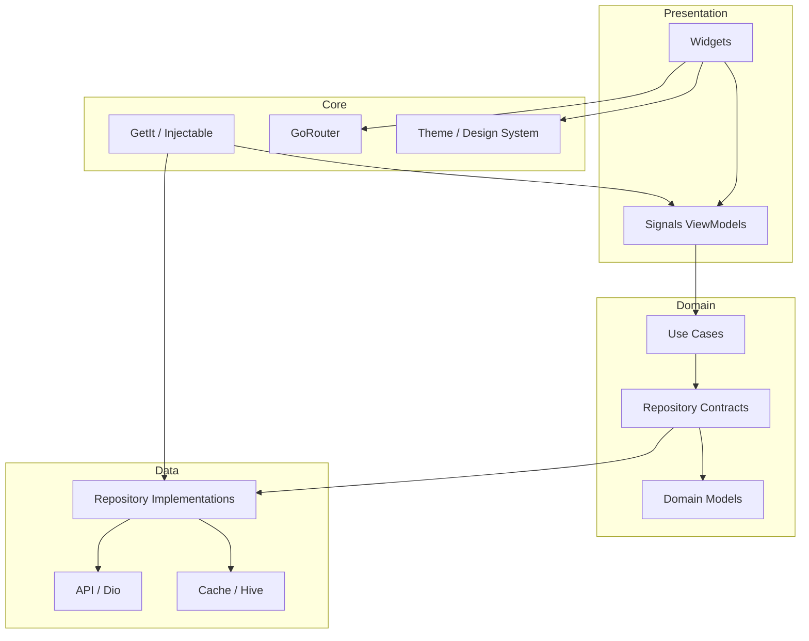

[](https://github.com/tsnAnh/flutter-agentic-starter/actions/workflows/dart.yml)
[](https://opensource.org/licenses/MIT)
[](https://flutter.dev)
[](https://dart.dev)
[](https://pub.dev/packages/flutter_lints)

# Flutter Agentic Starter

Production-ready Flutter starter built for AI-assisted development with Signals
and Clean Architecture. Its predictable feature structure, project skills,
setup wizard, and generated catalog let coding agents start shipping without
repeated architecture prompts.

## Why this starter?

| Capability | Included |
| --- | :---: |
| AI instruction files and project skills | ✅ |
| Signals-based Clean Architecture | ✅ |
| Setup wizard and multi-flavor entry points | ✅ |
| Firebase, analytics, cache, and offline queue | ✅ |
| Generated Widgetbook catalog | ✅ |

## Stack

- Signals 7 for reactive presentation and service state
- GetIt + Injectable for composition
- GoRouter for navigation
- Dio + fpdart for typed network results
- Hive for local cache and offline writes
- Freezed + json_serializable for immutable wire/domain models
- Flutter localization, Material 3, Firebase, and PostHog integrations

## Architecture



Features use `data/domain/presentation` boundaries:

```text
Screen -> ViewModel -> Use case -> Repository -> Data source
   ^          |
   +-- ReadonlySignal<AsyncState<T>>
```

View models own private mutable signals and expose read-only signals. Screens
receive their view model at the route boundary and rebuild with `SignalWidget`
or a focused `SignalBuilder`. Services may expose signals for app-wide state,
such as `SessionManager.active`, `ConnectivityService.online`, and
`OfflineQueueService.pendingCount`.

See [System architecture](docs/system-architecture.md) and
[Code standards](docs/code-standards.md).

## Features

| Module | Description | Key packages |
| --- | --- | --- |
| **State** | Reactive presentation and service state | Signals |
| **Network** | HTTP client, authentication, caching, retry, and connectivity interceptors | Dio |
| **Auth** | Session and in-memory token state | Signals, Dart SDK |
| **Cache** | Memory and persistent cache policies | Hive, Hive Flutter |
| **Connectivity** | Network monitoring and offline request replay | Connectivity Plus, Hive |
| **DI** | Generated dependency injection | GetIt, Injectable |
| **Router** | Declarative routing and deep links | GoRouter, App Links |
| **Models** | Immutable wire and domain models | Freezed, json_serializable |
| **Widgets** | Responsive shared widgets and generated component catalog | ScreenUtil, Widgetbook |
| **Firebase** | Analytics, Crashlytics, Remote Config, Messaging, and App Check | Firebase |
| **Analytics** | Composite analytics providers | Firebase Analytics, PostHog |
| **Permissions** | Runtime permission handling | Permission Handler |
| **Forms** | Validated reusable form inputs | Formz |
| **Lifecycle** | App lifecycle and update checks | Flutter SDK |
| **Logger** | Debug and production logging | Logger |
| **Localization** | Generated localized strings | Flutter localization, intl |

## Quick Start

```sh
# 1. Use this template, then clone your repository
git clone https://github.com/YOUR_USERNAME/your-app-name.git
cd your-app-name

# 2. Install dependencies
flutter pub get

# 3. Configure the template
dart run project_setup

# 4. Generate code
dart run build_runner build --delete-conflicting-outputs

# 5. Run the development entry point
flutter run -t lib/main.dart
```

Available entry points:

- `lib/main.dart`
- `lib/main_staging.dart`
- `lib/main_production.dart`

## Widgetbook

Generate the catalog after adding or changing a use case:

```sh
dart run build_runner build --delete-conflicting-outputs
```

Run Widgetbook locally in Chrome:

```sh
flutter run -t lib/widgetbook/widgetbook.dart -d chrome
```

## Project Structure

```text
lib/
├── app.dart
├── main.dart
├── main_staging.dart
├── main_production.dart
├── core/
│   ├── analytics/
│   ├── assets/
│   ├── auth/
│   ├── cache/
│   ├── connectivity/
│   ├── design_system/
│   ├── di/
│   ├── extensions/
│   ├── firebase/
│   ├── lifecycle/
│   ├── logger/
│   ├── network/
│   ├── permissions/
│   ├── router/
│   ├── theme/
│   └── utils/
├── features/
│   └── home/
│       ├── data/
│       ├── domain/
│       └── presentation/
├── shared/
│   ├── data/
│   ├── forms/
│   ├── i18n/
│   ├── services/
│   └── widgets/
└── widgetbook/
    ├── use_cases/
    ├── widgetbook.dart
    └── widgetbook.directories.g.dart
```

## Create a feature

1. Add the domain model, repository contract, and use case.
2. Implement the data source and repository.
3. Add an injectable `*ViewModel` with private `Signal` state.
4. Pass the view model from GoRouter into the screen.
5. Add focused view-model and widget tests.
6. Regenerate Injectable/Freezed/JSON code.

The Home feature is the reference implementation:
`lib/features/home/`.

## Customize the template

```sh
dart run project_setup \
  --app-name "Your App" \
  --dart-package-name your_app \
  --app-id com.example.yourapp \
  --organization Example \
  --yes
```

The checked-in template identity is:

- App name: `Flutter Agentic Starter`
- Dart package: `flutter_agentic_starter`
- Organization: `Example`
- Application ID: `dev.example.flutteragenticstarter`

## Verification

```sh
flutter analyze
flutter test
flutter build apk --release -t lib/main_staging.dart
```

## AI Agent Guide

### What Makes This Agent-Ready

Use `flutter-agentic-starter` only when implementing Flutter application code
under `lib/`, Flutter tests, or platform integration required by that code. It
does not apply to documentation, setup tooling, repository automation, or other
non-app maintenance.

- **Clean separation** — predictable `data/domain/presentation` boundaries
- **Signals conventions** — private mutable signals and public read-only state
- **Generated DI** — add Injectable annotations and regenerate
- **Preconfigured guidance** — `CLAUDE.md`, `AGENTS.md`, Cursor rules, and project skills

### Available Skills

- `flutter-agentic-starter` — Flutter/Signals/Clean Architecture rules
- `caveman` — concise technical communication
- `frontend-design` — polished user-facing Flutter UI

### Supported Tools

Works with Claude Code, Codex, OpenCode, Cursor, GitHub Copilot, Windsurf, and
other coding assistants that can read repository instructions.

### Example Prompts

```text
"Add a profile feature with a Signals ViewModel, use case, repository, and screen"
"Create an immutable Order model with Freezed and JSON serialization"
"Add a typed /users API flow with Dio and fpdart"
"Add a shared widget and cover its states in Widgetbook"
```

## Configuration

### Flavors

| Flavor | Entry point | Use case |
| --- | --- | --- |
| Development | `lib/main.dart` | Local development |
| Staging | `lib/main_staging.dart` | QA and internal testing |
| Production | `lib/main_production.dart` | Release builds |

### Environment Setup

Each flavor can configure its API, Firebase project, analytics, and feature
flags through `lib/core/flavor_configurations.dart` and generated DI.

## Showcase

Projects built with this template:

- [bit](https://github.com/tsnAnh/bit) — Flutter reader for Medium articles

Built something with this template? Open a pull request to add it here.

## Contributing

Contributions are welcome. See [CONTRIBUTING.md](CONTRIBUTING.md).

## License

[MIT](LICENSE) — tsnAnh

See the [documentation index](docs/README.md) for detailed guides.
