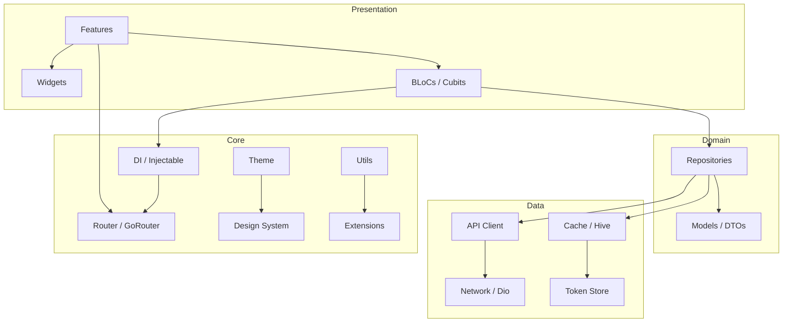

[](https://github.com/tsnAnh/flutter-agentic-starter/actions/workflows/dart.yml)
[](https://opensource.org/licenses/MIT)
[](https://flutter.dev)
[](https://dart.dev)
[](https://pub.dev/packages/flutter_lints)

# flutter-agentic-starter

> Production-ready Flutter BLoC template built for AI coding agents to scaffold features fast.

## Why This Template?

- **Built for Vibe Coding** — `CLAUDE.md`, `AGENTS.md`, clean DI patterns. AI agents scaffold features on day one. Perfect for vibe coding sessions.
- **18 Infrastructure Modules** — Networking, auth, cache, offline queue, Firebase, analytics, permissions, forms, lifecycle, and more.
- **Multi-Flavor Support** — Development, staging, and production entry points.
- **Production Architecture** — BLoC/Cubit, Injectable + GetIt DI, GoRouter, Freezed DTOs, fpdart, Material 3, and generated localization.
- **Template Setup Wizard** — Rename package/app IDs, configure Firebase/PostHog, refresh imports, and run codegen from one command.

## Architecture



## Features

| Module | Description | Key Packages |
|--------|-------------|--------------|
| **DataState** | Type-safe async state lifecycle | Dart sealed classes |
| **Base** | Base cubits, repositories, pagination, use cases | BLoC, fpdart |
| **Network** | HTTP client with auth, cache, retry, connectivity, logging interceptors | Dio |
| **Cache** | Memory and disk cache with repository mixins | Hive, Hive Flutter |
| **Connectivity** | Network monitoring and offline request queue | Connectivity Plus, Hive |
| **Auth** | Session and token management | In-memory token store |
| **Firebase** | Analytics, Crashlytics, Remote Config, Messaging, App Check | Firebase suite |
| **Analytics** | Multi-provider analytics abstraction | Firebase Analytics, PostHog |
| **Permissions** | Runtime permission handling | Permission Handler |
| **Design System** | Colors, spacing, radius, shadows, typography, durations | Flutter theme extensions |
| **Extensions** | Shared Dart and Flutter extension methods | Dart extensions |
| **Utils** | Color, date, string, number, responsive, snackbar, URL helpers | Shared utilities |
| **Router** | Declarative routing with deep linking | GoRouter, App Links |
| **Lifecycle** | App lifecycle management | — |
| **Logger** | Structured logging | Logger |
| **DI** | Dependency injection with code generation | GetIt, Injectable |
| **Theme** | Material 3 themes and color schemes | Flutter Material |
| **Forms** | Validated form inputs | Formz |

## Quick Start

```sh
# 1. Use this template (click "Use this template" on GitHub)
# 2. Clone your new repo
git clone https://github.com/YOUR_USERNAME/your-app-name.git
cd your-app-name

# 3. Install dependencies
flutter pub get

# 4. Run first-time setup wizard
dart run project_setup

# Noninteractive setup
dart run project_setup \
  --app-name "Acme App" \
  --dart-package-name acme_app \
  --app-id com.acme.app \
  --organization "Acme" \
  --skip-firebase \
  --skip-posthog \
  --yes

# Preview setup changes without writing files
dart run project_setup --dry-run

# 5. Generate code
dart run build_runner build --delete-conflicting-outputs

# 6. Run
flutter run -t lib/main_staging.dart
```

## Project Structure

```
lib/
├── app.dart                    # App widget
├── main.dart                   # Development entry point
├── main_staging.dart           # Staging flavor entry
├── main_production.dart        # Production flavor entry
├── core/
│   ├── analytics/              # Analytics abstraction
│   ├── assets/                 # Asset constants
│   ├── auth/                   # Auth/session/token management
│   ├── base/                   # Base classes (BLoC, etc.)
│   ├── cache/                  # Hive cache layer
│   ├── connectivity/           # Network monitoring + offline queue
│   ├── design_system/          # Design tokens
│   ├── di/                     # Injectable DI setup
│   ├── extensions/             # Dart/Flutter extensions
│   ├── firebase/               # Firebase initialization
│   ├── lifecycle/              # App lifecycle
│   ├── logger/                 # Logging utilities
│   ├── network/                # Dio client + interceptors
│   ├── permissions/            # Permission handling
│   ├── router/                 # GoRouter config
│   ├── theme/                  # ThemeData + colors
│   └── utils/                  # Shared utilities
├── features/
│   └── home/                   # Home feature (BLoC + UI)
└── shared/
    ├── blocs/                  # Shared BLoCs
    ├── data/                   # API clients, DTOs, repositories
    ├── forms/                  # Formz input classes
    ├── i18n/                   # Localization (ARB)
    ├── services/               # Shared services
    └── widgets/                # Reusable widgets

tool/
└── project_setup/              # Local setup wizard used by dart run project_setup

docs/
├── README.md                   # Documentation index
├── quick-start-guide.md
├── codebase-summary.md
├── system-architecture.md
├── code-standards.md
├── module-guides.md
├── project-overview-pdr.md
└── development-roadmap.md
```

Generated files such as `*.g.dart`, `*.freezed.dart`, and `lib/core/di/get_it.config.dart` are produced by build_runner. Edit source files, then regenerate.

## AI Agent Guide

### What Makes This Vibe-Coding-Ready

- **Clean separation** — features, core, shared layers with barrel exports
- **Injectable DI** — add `@injectable` and it's auto-registered
- **Consistent naming** — predictable file/class naming for AI discovery
- **Pre-configured guidance** — `CLAUDE.md`, `AGENTS.md`, `opencode.json`, `.claude/rules/`, project skills, and Cursor rules for AI context
- **Karpathy-style guardrails** — think first, keep simple, edit surgically, verify with concrete checks
- **Asset sourcing rules** — Flutter icons/images should come from suitable internet assets, using SVG for icons and PNG/JPG for raster or photo use cases

### Supported Tools

Works with **Claude Code**, **Codex**, **OpenCode**, **Cursor**, **GitHub Copilot**, **Windsurf**, and any AI coding assistant.

Project skills are included for:

- `flutter-agentic-starter` — Flutter/BLoC/Clean Architecture rules for this template
- `caveman` — terse technical reporting mode
- `frontend-design` — polished frontend/UI implementation guidance

Always invoke `flutter-agentic-starter` first before working in this project. During setup, `--app-name` renames this project skill to the app-name slug and updates agent instructions to invoke that app skill first.

Skill locations:

- Claude Code: `.claude/skills/`
- Codex: `.agents/skills/`
- OpenCode: `.opencode/skills/`

OpenCode also reads `opencode.json`, which includes the shared rules and docs as extra instructions.

### Example Prompts

```
"Add a new feature called 'profile' with BLoC, screen, and API integration"
"Create a new data model for 'Order' with Freezed"
"Add a new API endpoint for '/users' with Dio"
"Add Firebase Remote Config flag for 'enable_dark_mode'"
```

## Configuration

### Flavors

| Flavor | Entry Point | Use Case |
|--------|-------------|----------|
| Development | `lib/main.dart` | Local development |
| Staging | `lib/main_staging.dart` | Development & testing |
| Production | `lib/main_production.dart` | Release builds |

### Environment Setup

Each flavor uses `lib/core/flavor_configurations.dart` for base URL and timeout values. The setup wizard can also create `.env` for PostHog, run `flutterfire configure` when a Firebase project ID is provided, and install Claude Code/Codex hooks that warn when touched source files exceed 300 lines.

### Setup Wizard Options

```sh
dart run project_setup --help
```

Common options:

- `--app-name` — display name used by platform rename config and project skill rename
- `--dart-package-name` — Dart package name in `pubspec.yaml` and imports
- `--app-id` — native app ID / bundle ID
- `--organization` — organization used for generated platform metadata
- `--firebase-project-id` — runs FlutterFire configuration when available
- `--posthog-api-key` and `--posthog-host` — writes `.env` if missing
- `--skip-firebase`, `--skip-posthog`, `--skip-agent-hooks`, `--skip-pub-get`, `--skip-build-runner`
- `--dry-run` — prints planned changes without writing files

## Development

```sh
# Analyze
dart analyze

# Test
flutter test

# Build staging APK, same target used by CI
flutter build apk --release -t lib/main_staging.dart
```

After changing Injectable registrations, Freezed models, or JSON models:

```sh
dart run build_runner build --delete-conflicting-outputs
```

## Showcase

Projects built with this template:

- [bit](https://github.com/tsnAnh/bit) — A Flutter app to view Medium articles with integration token

> Built something with this template? [Open a PR](./CONTRIBUTING.md) to add it here!

## Contributing

Contributions welcome! See [CONTRIBUTING.md](./CONTRIBUTING.md).

## License

[MIT](./LICENSE) — tsnAnh
