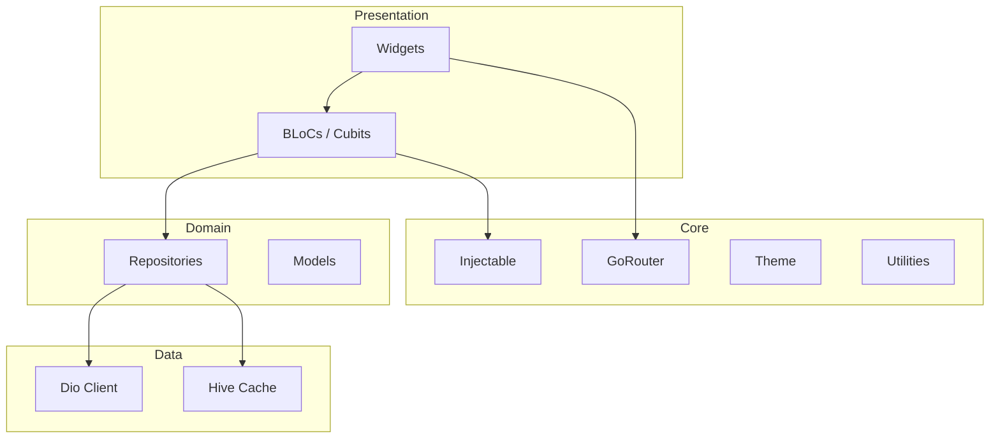

[](https://github.com/tsnAnh/flutter-agentic-starter/actions/workflows/dart.yml)
[](https://opensource.org/licenses/MIT)
[](https://flutter.dev)
[](https://dart.dev)
[](https://pub.dev/packages/flutter_lints)

# Flutter Agentic Starter

Production-ready Flutter starter optimized for AI coding agents.

Scaffold production features with Claude Code, Cursor and Codex — not just Flutter apps.

Build production-ready Flutter applications faster with **Claude Code**, **Cursor**, **Codex**, **GitHub Copilot**, **OpenCode**, **Windsurf**, and any modern AI coding assistant.

Instead of spending prompts explaining your architecture, start shipping features immediately.

---

## Why this starter?

| | Agentic Starter | Typical Starter |
|---------------------------|:---------------:|:--------------:|
| AI instruction files | ✅ | ❌ |
| Project skills | ✅ | ❌ |
| Setup wizard | ✅ | ❌ |
| Firebase ready | ✅ | ⚠️ |
| Offline queue | ✅ | ❌ |
| Analytics | ✅ | ❌ |
| Multi Flavor | ✅ | ⚠️ |

### 🚀 Built for Production

- Clean Architecture
- BLoC / Cubit
- Injectable + GetIt
- GoRouter
- Material 3
- Freezed
- Dio
- fpdart
- Generated localization
- Multi-flavor support

### 🤖 Built for AI Coding

Unlike generic Flutter templates, this project includes:

- Predictable project structure
- Stable naming conventions
- AI instruction files
- Project skills
- Consistent dependency injection
- Feature-first architecture
- Documentation optimized for AI understanding

This reduces the amount of context AI assistants need before generating useful code.

---

## 🔥 Key Features

### AI-Friendly Architecture

Spend tokens building features instead of explaining your project.

- Predictable folder structure
- Explicit architecture boundaries
- Consistent naming conventions
- Feature-first organization
- Ready-to-use project skills

---

### Production Infrastructure

Everything needed for a modern Flutter application.

- Networking
- Authentication
- Cache
- Offline queue
- Firebase
- Analytics
- Router
- Permissions
- Design System
- Forms
- Lifecycle
- Logging
- Theme
- Dependency Injection
- Utilities

---

### Developer Experience

Focus on building products.

Included out of the box:

- Setup wizard
- Code generation
- Multi-flavor support
- Firebase configuration
- PostHog integration
- Localization
- Build runner
- Generated DI
- Generated models

---

## ⚡ Quick Start

### 1. Create your project

Click **Use this template** on GitHub.

Clone your new repository.

```bash
git clone https://github.com/YOUR_USERNAME/your-app.git

cd your-app
```

---

### 2. Install dependencies

```bash
flutter pub get
```

---

### 3. Configure the project

Run the setup wizard.

```bash
dart run project_setup
```

Or configure everything automatically.

```bash
dart run project_setup \
  --app-name "Acme App" \
  --dart-package-name acme_app \
  --app-id com.acme.app \
  --organization "Acme" \
  --skip-firebase \
  --skip-posthog \
  --yes
```

Preview changes.

```bash
dart run project_setup --dry-run
```

---

### 4. Generate code

```bash
dart run build_runner build --delete-conflicting-outputs
```

---

### 5. Run

```bash
flutter run -t lib/main_staging.dart
```

---

## 🎯 Perfect For

- Startup MVPs
- Enterprise Flutter applications
- Solo developers
- Product teams
- AI-assisted development
- Teams using Claude Code
- Teams using Cursor
- Teams using Codex
- Developers who want a production-ready starting point

---

# 🏛 Architecture

Flutter Agentic Starter follows a layered **Clean Architecture** with clear boundaries and predictable conventions.

This structure helps teams scale large applications while making it easier for AI coding assistants to generate consistent code.



The architecture intentionally favors convention over configuration.

Whether a feature is created manually or generated by an AI coding assistant, every module follows the same predictable structure.

---

# 📦 Infrastructure Modules

Flutter Agentic Starter ships with **18 production-ready modules** already wired together.

| Module | Description |
|----------|-------------|
| **DataState** | Type-safe async state lifecycle |
| **Base** | Base Cubits, repositories, pagination, use cases |
| **Network** | Dio client, interceptors, retry, authentication |
| **Cache** | Memory + persistent storage using Hive |
| **Connectivity** | Network monitoring and offline request queue |
| **Auth** | Session & token management |
| **Firebase** | Analytics, Crashlytics, Messaging, Remote Config, App Check |
| **Analytics** | Firebase Analytics + PostHog abstraction |
| **Permissions** | Runtime permission handling |
| **Router** | Declarative routing with GoRouter |
| **Theme** | Material 3 themes |
| **Design System** | Colors, typography, spacing, radius, shadows |
| **Logger** | Structured application logging |
| **Lifecycle** | Application lifecycle handling |
| **Forms** | Form validation with Formz |
| **Extensions** | Shared Dart & Flutter extensions |
| **Utilities** | Date, string, responsive, snackbar helpers |
| **Dependency Injection** | Injectable + GetIt |

Everything is configured and connected out of the box.

No repetitive setup.

No copy-pasting infrastructure between projects.

---

# 🧠 AI Coding Workflow

The template is designed so AI assistants can understand your project with minimal context.

Instead of asking:

> Where should this file go?

or

> Which repository pattern should I follow?

AI can immediately start implementing features.

Typical workflow:

```text
Prompt

↓

Claude Code

↓

Reads Project Skills

↓

Generates

Repository
Cubit
DTO
DI
Route

↓

flutter run
```

This reduces architectural drift and keeps generated code consistent across the project.

---

# 📂 Project Structure

```text
lib/
├── app.dart
├── main.dart
├── main_staging.dart
├── main_production.dart
├── core/
    ├── analytics/
    ├── assets/
    ├── auth/
    ├── base/
    ├── cache/
    ├── connectivity/
    ├── design_system/
    ├── di/
    ├── extensions/
    ├── firebase/
    ├── lifecycle/
    ├── logger/
    ├── network/
    ├── permissions/
    ├── router/
    ├── theme/
    └── utils/
├── features/
    └── home/
└── shared/
    ├── blocs/
    ├── data/
    ├── forms/
    ├── i18n/
    ├── services/
    └── widgets/
```

Supporting tools:

```text
tool/
└── project_setup/
```

Documentation:

```text
docs/
├── README.md
├── quick-start-guide.md
├── system-architecture.md
├── module-guides.md
├── code-standards.md
├── development-roadmap.md
└── ...
```

---

# 📁 Typical Feature Structure

Every feature follows the same predictable layout.

```text
features/
└── profile/
    ├── data/
    │   ├── datasource/
    │   ├── dto/
    │   └── repository/
    ├── domain/
    │   ├── models/
    │   └── repository/
    ├── presentation/
    │   ├── cubit/
    │   ├── pages/
    │   └── widgets/
    └── di/
```

Keeping every feature consistent makes onboarding easier, improves maintainability, and allows AI coding assistants to generate higher-quality code with fewer prompts.

---

# ⚙️ Configuration

Flutter Agentic Starter includes a setup wizard and sensible defaults so you can start building immediately instead of manually configuring every service.

## Build Flavors

Three build flavors are included by default.

| Flavor | Entry Point | Purpose |
|---------|-------------|---------|
| Development | `lib/main.dart` | Local development |
| Staging | `lib/main_staging.dart` | QA & internal testing |
| Production | `lib/main_production.dart` | Release builds |

Each flavor can define its own:

- Base URL
- API timeout
- Firebase project
- Analytics configuration
- Feature flags
- App icon
- Bundle identifier

---

## Environment Configuration

Application configuration is centralized in:

```text
lib/core/flavor_configurations.dart
```

The setup wizard can automatically configure:

- FlutterFire
- PostHog
- Application IDs
- Package name
- Organization
- Environment variables

---

## Project Setup Wizard

Initialize a brand-new project in minutes.

```bash
dart run project_setup
```

Preview changes without modifying files.

```bash
dart run project_setup --dry-run
```

Show all available options.

```bash
dart run project_setup --help
```

Common options:

| Option | Description |
|---------|-------------|
| `--app-name` | Display name |
| `--dart-package-name` | Dart package |
| `--app-id` | Android package / iOS bundle ID |
| `--organization` | Organization name |
| `--firebase-project-id` | Configure FlutterFire |
| `--posthog-api-key` | Configure PostHog |
| `--posthog-host` | Custom PostHog endpoint |
| `--skip-firebase` | Skip Firebase |
| `--skip-posthog` | Skip PostHog |
| `--skip-agent-hooks` | Skip AI hooks |
| `--skip-pub-get` | Skip dependency install |
| `--skip-build-runner` | Skip code generation |

---

# 🤖 AI Agent Integration

Flutter Agentic Starter includes project context for modern AI coding assistants.

Supported tools:

| Tool | Support |
|------|---------|
| Claude Code | ✅ |
| Cursor | ✅ |
| Codex | ✅ |
| GitHub Copilot | ✅ |
| OpenCode | ✅ |
| Windsurf | ✅ |

Included project skills:

- flutter-agentic-starter
- frontend-design
- caveman

AI instruction files:

```text
CLAUDE.md
AGENTS.md
.claude/
.agents/
.opencode/
.cursor/
```

These files help AI assistants understand your architecture before generating code.

---

# 💻 Development

Install dependencies.

```bash
flutter pub get
```

Generate code.

```bash
dart run build_runner build --delete-conflicting-outputs
```

Analyze the project.

```bash
dart analyze
```

Run tests.

```bash
flutter test
```

Run staging.

```bash
flutter run -t lib/main_staging.dart
```

Build release APK.

```bash
flutter build apk --release -t lib/main_production.dart
```

---

# 🔄 Code Generation

The following files are automatically generated:

- `*.g.dart`
- `*.freezed.dart`
- `get_it.config.dart`

Whenever you change:

- Injectable services
- Freezed models
- JSON models

run:

```bash
dart run build_runner build --delete-conflicting-outputs
```

Generated files should not be edited manually.

---

# 🤝 Contributing

Contributions of every size are welcome.

You can help by:

- Reporting bugs
- Improving documentation
- Adding infrastructure modules
- Creating example applications
- Improving developer experience
- Optimizing performance
- Suggesting new features

Please read:

```text
CONTRIBUTING.md
```

before opening a Pull Request.

---

# 🌟 Support the Project

If Flutter Agentic Starter saves you time, consider giving the repository a ⭐.

It helps more developers discover the project and motivates future development.

You can also contribute by:

- Sharing the project
- Reporting issues
- Opening pull requests
- Suggesting improvements

Every contribution is appreciated.

---

# 📄 License

Distributed under the MIT License.

See the [LICENSE](LICENSE) file for more information.

---

<div align="center">

# Flutter Agentic Starter

### Production-ready Flutter architecture built for the AI coding era.

Build faster.

Ship confidently.

Let AI handle the repetitive work.

⭐ **If this project helps you, consider starring the repository.**

Made with ❤️ for the Flutter community.

</div>
