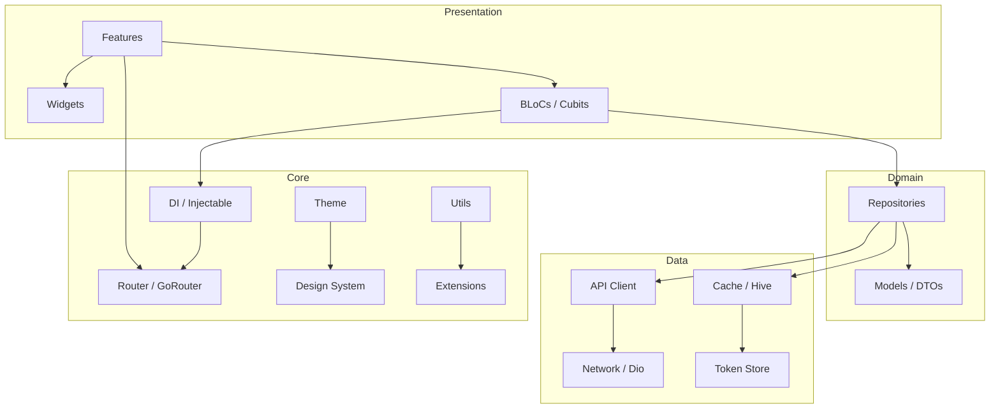

[](https://github.com/tsnAnh/flutter-agentic-starter/actions/workflows/dart.yml)
[](https://opensource.org/licenses/MIT)
[](https://flutter.dev)
[](https://dart.dev)
[](https://pub.dev/packages/flutter_lints)

# flutter-agentic-starter

> Production-ready Flutter BLoC template built for AI coding agents to scaffold features fast.

## Why This Template?

- **Built for Vibe Coding** — `CLAUDE.md`, `AGENTS.md`, clean DI patterns. AI agents scaffold features on day one. Perfect for vibe coding sessions.
- **17 Core Modules** — Networking, auth, storage, Firebase, analytics, permissions, lifecycle — all pre-wired.
- **Multi-Flavor Support** — Staging + Production configs out of the box.
- **Production Architecture** — BLoC pattern, Injectable DI, GoRouter, Freezed models, fpdart functional programming.

## Architecture



## Features

| Module | Description | Key Packages |
|--------|-------------|--------------|
| **Network** | HTTP client with interceptors, error handling | Dio |
| **Auth** | Authentication flow, token management | In-memory token store |
| **Cache** | Local data persistence | Hive, Hive Flutter |
| **DI** | Dependency injection with code generation | GetIt, Injectable |
| **Router** | Declarative routing with deep linking | GoRouter, App Links |
| **State** | Reactive state management | BLoC, HydratedBloc |
| **Models** | Immutable data classes with serialization | Freezed, JSON |
| **Theme** | Design system, responsive scaling | ScreenUtil |
| **Firebase** | Analytics, Crashlytics, Remote Config, Messaging, App Check | Firebase suite |
| **Analytics** | Product analytics | PostHog |
| **Connectivity** | Network status monitoring | Connectivity Plus |
| **Permissions** | Runtime permission handling | Permission Handler |
| **Lifecycle** | App lifecycle management | — |
| **Logger** | Structured logging | Logger |

## Quick Start

```sh
# 1. Use this template (click "Use this template" on GitHub)
# 2. Clone your new repo
git clone https://github.com/YOUR_USERNAME/your-app-name.git
cd your-app-name

# 3. Run first-time setup wizard
dart run project_setup

# Noninteractive setup
dart run project_setup \
  --app-name "Acme App" \
  --dart-package-name acme_app \
  --app-id com.acme.app \
  --organization "Acme" \
  --yes

# 4. Generate code
dart run build_runner build

# 5. Run
flutter run -t lib/main_staging.dart
```

## Project Structure

```
lib/
├── app.dart                    # App widget
├── main.dart                   # Default entry point
├── main_staging.dart           # Staging flavor entry
├── main_production.dart        # Production flavor entry
├── core/
│   ├── analytics/              # Analytics abstraction
│   ├── assets/                 # Asset constants
│   ├── auth/                   # Auth management
│   ├── base/                   # Base classes (BLoC, etc.)
│   ├── cache/                  # Hive cache layer
│   ├── connectivity/           # Network monitoring
│   ├── design_system/          # Design tokens
│   ├── di/                     # Injectable DI setup
│   ├── extensions/             # Dart/Flutter extensions
│   ├── firebase/               # Firebase initialization
│   ├── lifecycle/              # App lifecycle
│   ├── logger/                 # Logging utilities
│   ├── network/                # Dio client + interceptors
│   ├── permissions/            # Permission handling
│   ├── router/                 # GoRouter config
│   ├── theme/                  # ThemeData + colors
│   └── utils/                  # Shared utilities
├── features/
│   └── home/                   # Home feature (BLoC + UI)
└── shared/
    ├── blocs/                  # Shared BLoCs
    ├── data/                   # API, models, repositories
    ├── forms/                  # Formz input classes
    ├── i18n/                   # Localization (ARB)
    ├── services/               # Shared services
    └── widgets/                # Reusable widgets
```

## AI Agent Guide

### What Makes This Vibe-Coding-Ready

- **Clean separation** — features, core, shared layers with barrel exports
- **Injectable DI** — add `@injectable` and it's auto-registered
- **Consistent naming** — predictable file/class naming for AI discovery
- **Pre-configured guidance** — `CLAUDE.md`, `AGENTS.md`, `.claude/rules/`, and Cursor rules for AI context
- **Karpathy-style guardrails** — think first, keep simple, edit surgically, verify with concrete checks

### Supported Tools

Works with **Claude Code**, **Cursor**, **GitHub Copilot**, **Windsurf**, and any AI coding assistant.

### Example Prompts

```
"Add a new feature called 'profile' with BLoC, screen, and API integration"
"Create a new data model for 'Order' with Freezed"
"Add a new API endpoint for '/users' with Dio"
"Add Firebase Remote Config flag for 'enable_dark_mode'"
```

## Configuration

### Flavors

| Flavor | Entry Point | Use Case |
|--------|-------------|----------|
| Staging | `lib/main_staging.dart` | Development & testing |
| Production | `lib/main_production.dart` | Release builds |

### Environment Setup

Each flavor can configure its own API base URL, Firebase project, and feature flags through the DI module.

## Showcase

Projects built with this template:

- [bit](https://github.com/tsnAnh/bit) — A Flutter app to view Medium articles with integration token

> Built something with this template? [Open a PR](./CONTRIBUTING.md) to add it here!

## Contributing

Contributions welcome! See [CONTRIBUTING.md](./CONTRIBUTING.md).

## License

[MIT](./LICENSE) — tsnAnh
