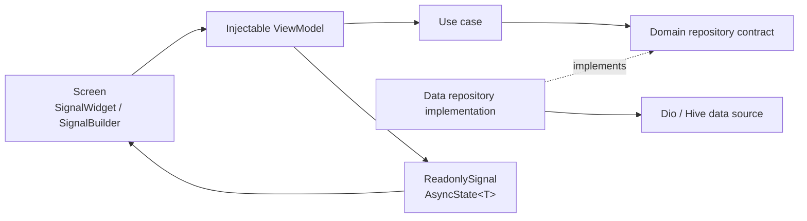
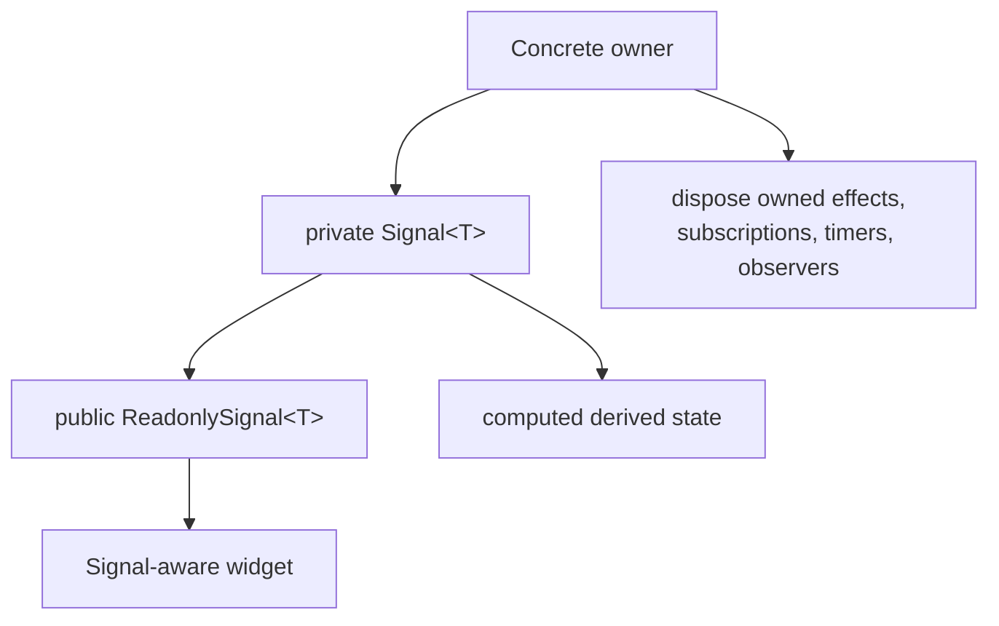
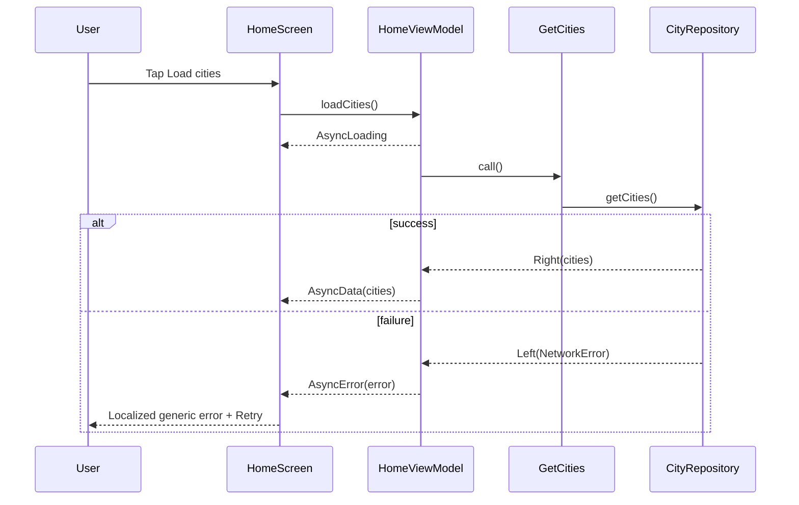

# System architecture

## Feature flow

Dependencies point toward domain code. The data layer implements domain
contracts; presentation never depends directly on Dio or Hive.

## State ownership

- Widget-only interaction state stays local.
- Feature state lives in a route-scoped view model.
- Cross-feature state lives in a focused lazy-singleton service.
- Derived state uses `computed`, not duplicated mutable values.
- `batch` groups only writes that must be observed atomically.

## Async request sequence

## App composition

`initializeFlutterApp` initializes Flutter bindings, Firebase, Hive, Injectable,
cache, connectivity, offline queue, error reporting, and analytics before
mounting `App`. Signals uses its built-in debug tooling; the app does not add a
parallel state observer.

GoRouter owns navigation. A route resolves its feature view model from GetIt
and passes it into the screen constructor. This makes dependencies explicit and
keeps providers out of the widget tree.

## Long-lived reactive services

- `SessionManager.active`: volatile session state; starts false.
- `ConnectivityService.online`: interface availability.
- `ConnectivityService.offline`: computed inverse.
- `OfflineQueueService.pendingCount`: Hive queue length.
- `PermissionViewModel.statuses`: permission state with resume rechecks.

Any service that creates a connection stores its cleanup and releases it from
`dispose`.
